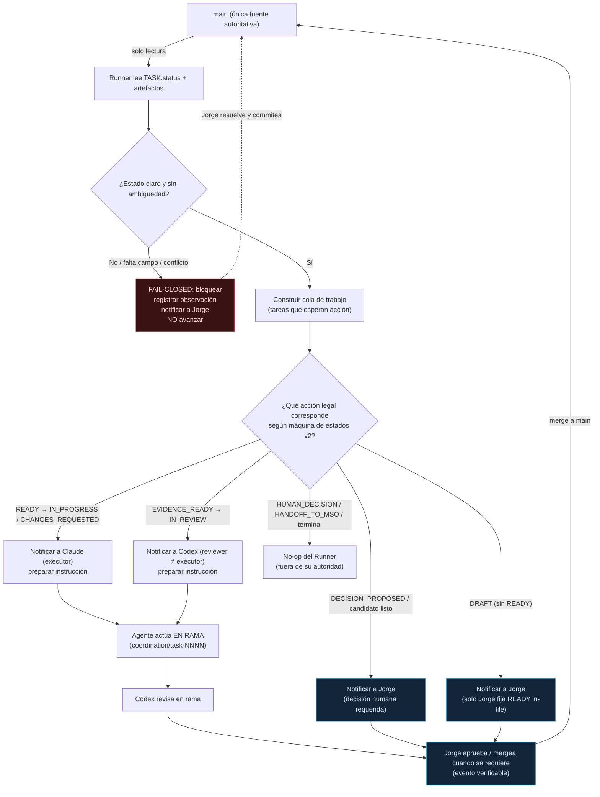

# RUNNER DESIGN REVIEW — Runner manual mínimo de Assistant OS Internal Communications

> **Estado:** propuesta de **diseño/revisión**. **No implementa nada.** No es contrato vigente.
> **Vinculado a:** `coordination/tasks/TASK-0004.md` (status `DRAFT`).
> **Contrato base:** v3.1 (`README.md`, `RULES_OF_ENGAGEMENT.md`, `AGENT_CONTRACT.md`, `schemas/`).
> **Regla de oro de este documento:** el Runner es un **coordinador mecánico conservador**, **nunca** autoridad. Lee `main`, propone el siguiente paso legal y notifica. No decide, no aprueba, no ejecuta, no mergea.

---

## 1. Resumen ejecutivo

El bus `coordination/` funciona end-to-end (dogfood v2 → v3 → v3.1 cerrado, `TASK-0002` en `HUMAN_DECISION`). Pero entre cada paso del ciclo **Jorge sigue siendo cable**: un humano debe leer el estado de `main`, deducir qué agente actúa a continuación, abrir el artefacto correcto y arrancar al agente. Ese trabajo de "transporte" es mecánico, repetitivo y no requiere autoridad.

El **Runner** se propone como el mecanismo que **reduce ese cable humano** sin convertirse en autoridad. En una futura implementación, el Runner solo:

1. lee `main` (solo lectura);
2. detecta el `status` canónico de cada tarea y los artefactos presentes;
3. construye una **cola de trabajo** (qué tareas esperan acción);
4. determina, por la máquina de estados v2, **qué acción legal** corresponde y **qué rol** debe ejecutarla;
5. **notifica/prepara instrucciones** para ese rol;
6. se **bloquea** ante ambigüedad (fail-closed);
7. **registra observaciones** auditables.

El Runner **jamás** mergea, aprueba, declara `human_final`, promueve un `DECISION_CANDIDATE`, fija `HANDOFF_TO_MSO`, toca MSO/Police/Policy/Auth, ejecuta tareas funcionales, ni usa secretos/workflows. Su única defensa real no es honor-system: es **control de acceso** (solo lectura sobre `main`, sin permiso de merge/aprobación/push).

Este documento es **diseño/revisión**. No autoriza implementación. El siguiente paso es la revisión de Codex y, después, la decisión humana de Jorge.

---

## 2. Alcance

Dentro de alcance de **este review** (no de implementación):

- Definir el problema que el Runner resuelve y el que **no** resuelve aún.
- Definir entradas (qué lee), salidas (qué produce) y la máquina de estados que observa.
- Definir la lógica de despacho: cómo deduce que Claude debe actuar, que Codex debe revisar, o que Jorge debe decidir.
- Definir la matriz de permisos, las reglas fail-closed y las invariantes V3.1 que debe preservar.
- Definir permisos mínimos de una implementación futura, riesgos de seguridad, el dry-run manual previo, el MVP y el siguiente paso.

---

## 3. No-alcance (explícito)

Este documento **NO**:

- implementa el Runner ni crea scripts ejecutables;
- crea GitHub Actions, cron, Docker, túnel/VPS, headless automation;
- usa o crea tokens/secretos ni cambia permisos;
- fija `HANDOFF_TO_MSO` ni mueve ninguna tarea;
- modifica MSO/Police/Policy/Auth ni contrato/schemas vigentes (cualquier cambio vive solo como *draft* en `proposals/`);
- otorga al Runner ninguna capacidad de autoridad (merge, approve, promote, decide).

El Runner descrito es un **diseño conceptual**. Nada aquí es ejecutable ni autoritativo.

---

## 4. Modelo conceptual y flujo (Mermaid)

Flujo deseado (conservador): `main state → runner reads → detects next legal action → proposes dispatch → agent acts in branch → Codex reviews → Jorge approves/merges when required`.

**Frontera dura (lo que el Runner NUNCA hace, fuera del grafo de acciones):** merge, approve PR, push a `main`, escribir `human_final`/`effective_authority`/`approved_by`, promover un `DECISION_CANDIDATE` a `decisions/`, fijar `HUMAN_DECISION`/`HANDOFF_TO_MSO`/`CLOSED_REJECTED`/`ABORTED`, tocar MSO/Police/Policy/Auth, ejecutar tareas funcionales.

---

## 5. Entradas / Salidas

### 5.1 Entradas (qué lee el Runner — solo lectura sobre `main`)

| # | Entrada | Fuente (en `main`) | Para qué |
|---|---|---|---|
| I1 | `status`, `blocked`, `last_legit_status`, `next_action` | `coordination/tasks/TASK-NNNN.md` (front-matter) | Estado canónico y siguiente paso declarado |
| I2 | `assigned_agent`, `reviewer`, `reviewer_delegate` | `TASK-NNNN.md` | Saber a quién notificar (executor/reviewer) |
| I3 | Presencia de WORKLOG / FINAL_REPORT | `worklogs/`, `reports/` | Confirmar evidencia antes de proponer review |
| I4 | Presencia/estado de REVIEW (`proposed_decision`) | `reviews/TASK-NNNN.REVIEW.md` | Detectar convergencia / cambios solicitados |
| I5 | Presencia de `DECISION_CANDIDATE` | `candidates/TASK-NNNN.DECISION_CANDIDATE.md` | Detectar que falta decisión humana (notificar, **no** promover) |
| I6 | Presencia de `DECISION` efectiva | `decisions/TASK-NNNN.DECISION.md` | Reconocer cierre humano (no-op del Runner) |
| I7 | Contrato y schemas vigentes | `README.md`, `RULES_OF_ENGAGEMENT.md`, `AGENT_CONTRACT.md`, `schemas/` | Validar transiciones legales |

> El Runner **no** lee el chat, **no** lee ramas como autoridad, **no** lee secretos ni `.env`. "Si no está en `main`, no pasó."

### 5.2 Salidas (qué produce el Runner — observaciones/notificaciones, nunca autoridad)

| # | Salida | Naturaleza | Límite |
|---|---|---|---|
| O1 | **Cola de trabajo** (lista de tareas que esperan acción + acción legal sugerida + rol destino) | Reporte de solo lectura | Sugerencia, no orden; no muta estado |
| O2 | **Notificación de despacho** (a Claude / Codex / Jorge): "TASK-NNNN espera <acción legal> por <rol>" | Mensaje / preparación de instrucción | No arranca ejecución por sí mismo |
| O3 | **Instrucción preparada** (borrador de prompt/contexto para el agente, apuntando a artefactos de `main`) | Texto preparado | El agente humano/operador lo lanza; el Runner no lo ejecuta |
| O4 | **Registro de observaciones** (append-only, auditable) | Log | No es artefacto de autoridad; no toca TASK.status |
| O5 | **Bloqueo + motivo** ante ambigüedad | Observación fail-closed | No avanza; deja el caso para Jorge |

> Ninguna salida del Runner **fija** un `status`, **escribe** un artefacto de autoridad (`decisions/`, campos de aprobación), ni **muta** `main`. Como mucho, propone un `proposed_decision`/`next_action` **para que un agente lo escriba en rama** — y eso es opcional; el MVP no lo necesita.

---

## 6. Estados observados y despacho

Estados de la máquina v2 (`README.md` §Máquina de estados) y qué hace el Runner en cada uno:

| `status` observado en `main` | Evento que detecta | Acción legal siguiente | Runner notifica a | ¿El Runner puede hacerlo? |
|---|---|---|---|---|
| `DRAFT` | Tarea sin `READY` | `DRAFT → READY` (solo Jorge, in-file) | **Jorge** | No — solo notifica |
| `READY` | Tarea autorizada en `main` | `READY → IN_PROGRESS` | **Claude** (executor) | No — solo notifica/prepara |
| `IN_PROGRESS` | Executor trabajando | (esperar evidencia) | nadie / observa | No — no interrumpe |
| `EVIDENCE_READY` | WORKLOG+FINAL_REPORT presentes | `EVIDENCE_READY → IN_REVIEW` | **Codex** (reviewer ≠ executor) | No — solo notifica |
| `IN_REVIEW` | REVIEW en curso | (esperar veredicto) | observa | No |
| `CHANGES_REQUESTED` | Codex pidió cambios | `CHANGES_REQUESTED → IN_PROGRESS` | **Claude** (executor) | No — solo notifica |
| `DECISION_PROPOSED` | Convergencia / candidato listo | `→ HUMAN_DECISION` (solo Jorge) | **Jorge** | No — **jamás** promueve candidato |
| `HUMAN_DECISION` | Decisión humana efectiva | `→ HANDOFF_TO_MSO` (solo MSO) | observa / no-op | No — fuera de su autoridad |
| `HANDOFF_TO_MSO` | Terminal (MSO) | — | no-op | No |
| `CLOSED_REJECTED` | Terminal (Jorge) | — | no-op | No |
| `BLOCKED` | Tramo bloqueado | `BLOCKED → last_legit_status` (agente del tramo) | rol del tramo + Jorge | No — solo notifica |
| `ABORTED` | Terminal | — | no-op | No |

### 6.1 ¿Cómo decide que **Claude** debe actuar?

Cuando `status ∈ {READY, CHANGES_REQUESTED}` en `main`, la transición legal pertenece al **executor** (`assigned_agent`, por defecto Claude). El Runner construye la notificación de despacho hacia Claude y prepara la instrucción apuntando al `TASK-NNNN.md` y artefactos relevantes de `main`. **No arranca a Claude**; deja el despacho listo.

### 6.2 ¿Cómo decide que **Codex** debe revisar?

Cuando `status == EVIDENCE_READY` y existen WORKLOG + FINAL_REPORT, la transición legal pertenece al **reviewer** (`reviewer`/`reviewer_delegate`, ≠ executor). El Runner verifica la **no auto-revisión** (reviewer ≠ assigned_agent) antes de notificar; si coincidieran o faltara el delegate registrado in-file, **fail-closed** (bloquea, no despacha).

### 6.3 ¿Cómo notifica a **Jorge** sin convertirlo en cable?

Para `DRAFT` (falta `READY`), `DECISION_PROPOSED`/candidato listo (falta decisión humana), o cualquier bloqueo, el Runner produce una **notificación consolidada**: qué tarea, en qué estado, qué decisión humana se requiere y dónde está la evidencia ya en `main`. Jorge **no transporta contexto** ni rastrea estados a mano: lee la cola y actúa por evento verificable (merge/aprobación). El cable se reduce de "vigilar + deducir + abrir + arrancar" a "decidir".

---

## 7. Matriz de permisos

| Capacidad | Runner | Quién sí |
|---|---|---|
| Leer `main` (`coordination/`) | ✅ solo lectura | — |
| Construir cola de trabajo / reportar estado | ✅ | — |
| Notificar al rol que corresponde | ✅ | — |
| Preparar instrucción/borrador (apuntando a `main`) | ✅ | — |
| Registrar observaciones (append-only) | ✅ | — |
| Bloquearse y reportar ante ambigüedad | ✅ (obligatorio) | — |
| Escribir `TASK.status` (cualquiera) | ❌ | el rol propietario del estado |
| Escribir WORKLOG/FINAL_REPORT/REVIEW/CANDIDATE en rama | ❌ | Claude / Codex (en rama) |
| Promover un `DECISION_CANDIDATE` a `decisions/` | ❌ **jamás** | solo Jorge (evento verificable) |
| Escribir `human_final` / `effective_authority` / `approved_by` | ❌ **jamás** | solo Jorge |
| Mergear / aprobar PR / push a `main` | ❌ **jamás** | solo Jorge |
| Fijar `HUMAN_DECISION` / `CLOSED_REJECTED` / `ABORTED` | ❌ **jamás** | Jorge (ABORTED: iniciador/Jorge/MSO-Police) |
| Fijar `HANDOFF_TO_MSO` | ❌ **jamás** | solo MSO (tras decisión de Jorge) |
| Tocar MSO / Police / Policy / Auth | ❌ **jamás** | — (fuera de este plano) |
| Ejecutar tareas funcionales / acciones de dominio | ❌ **jamás** | MSO → Police → Pipeline |
| Usar/crear secretos, tokens, workflows | ❌ **jamás** (sin revisión separada) | — |

**Enforcement primario:** control de acceso del repositorio (el Runner es una identidad **solo lectura** sobre `main`, sin merge/approve/push). **Secundario:** verificabilidad contra el historial. No es honor-system.

---

## 8. Reglas fail-closed

1. **Ambigüedad ⇒ bloqueo.** Campo `required` ausente, `status`/`authority` fuera de enum, o transición no mapeada ⇒ el Runner **no propone acción**, registra observación y notifica a Jorge.
2. **Conflicto de estado ⇒ bloqueo.** Si dos artefactos discrepan (p. ej. `status` dice una cosa y los artefactos otra), el Runner **no resuelve**: bloquea y reporta. La fuente es `main`; si `main` es contradictorio, es trabajo humano.
3. **Solo `main`.** El Runner ignora ramas y chat como autoridad. Sin `READY` en `main`, una tarea sigue en `DRAFT` y el Runner solo notifica a Jorge.
4. **No auto-review.** Antes de despachar a un reviewer, verifica `reviewer ≠ assigned_agent` (y delegate ≠ executor, registrado in-file). Si no se cumple ⇒ bloqueo.
5. **No promoción.** El Runner detecta candidatos y los **notifica**; **nunca** los promueve a `human_final` ni los copia a `decisions/`.
6. **No mutación.** El Runner no escribe en `coordination/tasks/` ni en `decisions/`; su única escritura es su propio log de observaciones (fuera de los artefactos canónicos).
7. **Terminales ⇒ no-op.** En `HANDOFF_TO_MSO`, `CLOSED_REJECTED`, `ABORTED`, el Runner no actúa.
8. **Ante duda entre avanzar o preservar integridad: preserva integridad.** Bloquea y reporta.

---

## 9. Invariantes V3.1 que el Runner debe preservar

1. **`main` es la única fuente autoritativa.** Las ramas proponen; el chat nunca es autoridad. "Si no está commiteado, no pasó."
2. **`authorship != authority`.** El Runner puede *detectar y notificar* candidatos; **solo** el evento verificable de Jorge materializa `human_final`.
3. **Estado único canónico** = `TASK.status` en `main`. El Runner no duplica ni redefine estado.
4. **Propose / Review / Decide / Execute están separados** y los ejecutan sujetos distintos. El Runner no colapsa esa separación; solo enruta.
5. **No auto-review:** ejecutor ≠ revisor ≠ delegate.
6. **Ningún agente (ni el Runner) confiere autoridad.** Tokens prohibidos en escritura: `human_final`, `effective_authority=human_final`, `approved_by`, `approval_method`, `approved_at`, `decided_by: jorge`, `mso_executable`.
7. **Runner no promueve** (cláusula 12 del AGENT_CONTRACT y `RULES_OF_ENGAGEMENT` §Candidatos): puede detectar/notificar, nunca promover/mergear/aprobar.
8. **Fail-closed** ante ambigüedad; no se inventa comportamiento.
9. **Nada de este plano ejecuta.** El Runner coordina; MSO/Police ejecutan.
10. **Enforcement por control de acceso**, no por honor-system.

---

## 10. Permisos mínimos de una implementación futura

> Listado de **diseño**; no se solicita ni se concede nada en este PR.

| Permiso mínimo | Por qué | Lo que NO incluye |
|---|---|---|
| Lectura de `coordination/` en `main` | Detectar estado y artefactos | Sin lectura de `.env`/secrets/auth |
| Canal de notificación (salida) | Avisar al rol que corresponde | Sin capacidad de arrancar ejecución por sí mismo |
| Almacén append-only para su log de observaciones | Trazabilidad/auditoría | Fuera de los artefactos canónicos; no toca `tasks/`/`decisions/` |

**Explícitamente NO necesita** (y no debe tener): merge/approve/push, tokens de escritura a `main`, acceso a MSO/Police/Policy/Auth, secretos, workflows, cron, contenedores, red saliente arbitraria. La identidad debe ser **solo lectura** sobre `main`. Cualquier permiso por encima de lectura+notificación es **fuera de alcance** y requiere su propio review separado.

---

## 11. Riesgos de seguridad

| # | Riesgo | Severidad | Mitigación de diseño |
|---|---|---|---|
| R1 | **Escalada a autoridad** (el Runner termina mergeando/aprobando/promoviendo) | Crítico | Identidad solo lectura; sin merge/approve/push; matriz de permisos §7; enforcement por acceso |
| R2 | **Autoridad paralela** (el Runner se vuelve segunda fuente de estado) | Crítico | El Runner no escribe estado; única fuente sigue siendo `TASK.status` en `main` |
| R3 | **Bypass de no-auto-review** (despacha reviewer = executor) | Alto | Verificación §8.4; fail-closed si no se cumple |
| R4 | **Estado obsoleto/caché** (lee algo que no es el `main` actual) | Alto | Leer siempre el `main` vigente; sin caché autoritativa; reproducible |
| R5 | **Inyección vía contenido de artefactos** (un campo malicioso induce acción) | Medio | El Runner solo enruta por enum cerrado de `status`; ignora texto libre como instrucción |
| R6 | **Notificación como coerción** (la sugerencia se trata como orden) | Medio | O1–O3 son sugerencias, no órdenes; el agente/Jorge decide; queda registrado |
| R7 | **Filtración de secretos** | Alto | No lee `.env`/secrets/auth; sin tokens; sin red saliente arbitraria |
| R8 | **Drift de contrato** (el Runner asume reglas viejas) | Medio | Lee contrato/schemas de `main` como fuente de transiciones legales |

---

## 12. Pruebas / dry-run manual previo a cualquier implementación

Antes de implementar **una sola línea**, debe ejecutarse un **dry-run manual** (humano, sobre papel/repositorio real, sin código):

1. **Snapshot de `main`.** Tomar el estado real de todas las `TASK-NNNN.md` y artefactos.
2. **Cola esperada vs. derivada.** Un humano construye a mano la cola de trabajo y la acción legal de cada tarea; se compara con lo que el diseño del Runner produciría. Deben coincidir.
3. **Casos fail-closed.** Inyectar (en una rama de prueba, nunca en `main`) campos faltantes / estados contradictorios / reviewer = executor, y verificar que el diseño **bloquea** en cada caso.
4. **Casos de no-autoridad.** Verificar que en `DECISION_PROPOSED`, `HUMAN_DECISION`, `HANDOFF_TO_MSO` el diseño produce notificación/no-op y **nunca** una mutación.
5. **Revisión por Codex** del cuaderno de dry-run.
6. **Decisión humana de Jorge** sobre si pasar (o no) a un MVP, en un ciclo separado.

Solo si el dry-run manual es limpio y Jorge lo aprueba por evento verificable, se podría plantear un MVP — en **otro** PR.

---

## 13. MVP propuesto (el más pequeño posible)

**MVP = "Read-only queue reporter".** Un proceso **manual** (lanzado a mano por un humano, sin cron/daemon) que:

1. lee `coordination/tasks/*.md` en `main` (solo lectura);
2. imprime una **cola**: por cada tarea, su `status` y la **acción legal siguiente + rol destino** (tabla §6);
3. marca en rojo los casos **fail-closed** (ambigüedad/conflicto/no-auto-review);
4. **no escribe nada** en los artefactos canónicos; a lo sumo un log de observaciones append-only.

Lo que el MVP **deja fuera a propósito:** despacho automático, arranque de agentes, escritura de cualquier artefacto, notificaciones push, scheduling, red. Es un **lector que ordena la cola**, nada más. Toda capacidad adicional es un review aparte.

---

## 14. Criterios de aceptación del diseño

- [ ] El documento responde las 15 preguntas guía (§15).
- [ ] Incluye resumen ejecutivo, alcance, no-alcance, diagrama Mermaid, tabla I/O, tabla de estados, matriz de permisos, fail-closed, invariantes V3.1, riesgos, MVP y siguiente paso.
- [ ] Deja explícito y no relajable que el Runner **jamás** mergea, aprueba, declara `human_final`, promueve candidatos, fija `HANDOFF_TO_MSO`, toca MSO/Police/Policy/Auth, ejecuta tareas, ni usa secretos/workflows sin review separado.
- [ ] No implementa Runner, no crea scripts, no toca código ni contrato activo.
- [ ] El enforcement descrito es **control de acceso** (solo lectura), no honor-system.
- [ ] Es coherente con el contrato v3.1 vigente (sin contradicciones).

---

## 15. Anexo — Las 15 preguntas, respondidas

1. **¿Qué problema resuelve?** Reduce el cable humano de transporte/enrutamiento entre pasos del bus (§1).
2. **¿Qué NO resuelve todavía?** No ejecuta tareas, no decide, no automatiza el ciclo completo; no sustituye a MSO ni a Jorge (§1, §3, §13).
3. **¿Qué archivos lee?** `tasks/`, `worklogs/`, `reports/`, `reviews/`, `candidates/`, `decisions/`, contrato/schemas — todo en `main`, solo lectura (§5.1).
4. **¿Qué estados observa?** Todo el enum v2 (§6).
5. **¿Qué eventos detecta?** Cambios de `status`, presencia de artefactos, convergencia, candidatos, bloqueos (§6).
6. **¿Qué output produce?** Cola, notificación, instrucción preparada, log, bloqueo+motivo (§5.2).
7. **¿Cómo decide que Claude debe actuar?** `status ∈ {READY, CHANGES_REQUESTED}` ⇒ executor (§6.1).
8. **¿Cómo decide que Codex debe revisar?** `status == EVIDENCE_READY` con evidencia presente y reviewer ≠ executor (§6.2).
9. **¿Cómo notifica a Jorge sin hacerlo cable?** Cola consolidada con contexto ya en `main`; Jorge solo decide (§6.3).
10. **¿Qué hace ante conflicto/ambigüedad?** Fail-closed: bloquea, registra, notifica, no avanza (§8).
11. **¿Qué invariantes de V3.1 preserva?** Las 10 de §9.
12. **¿Qué permisos mínimos necesitaría?** Lectura de `coordination/` en `main` + canal de notificación + log append-only; nada más (§10).
13. **¿Qué riesgos de seguridad existen?** R1–R8 (§11).
14. **¿Qué pruebas/dry-run previos?** Dry-run manual de 6 pasos antes de implementar (§12).
15. **¿Cuál es el MVP más pequeño?** "Read-only queue reporter" manual (§13).

---

## 16. Siguiente paso recomendado tras este review

1. **Codex** revisa este documento (`reviews/TASK-0004.REVIEW.md`): verifica que el Runner no adquiere autoridad, que respeta v3.1, que es solo diseño, y que el MVP es mínimo y fail-closed.
2. **Jorge** decide (evento verificable) si el diseño es aceptable y si autoriza —en un **ciclo separado**— el **dry-run manual** (§12). El dry-run **no** es implementación.
3. Solo tras un dry-run limpio + aprobación humana, se plantearía el **MVP read-only** (§13) en **otro** PR, también sujeto a review.

> Este PR **no** implementa, **no** programa, **no** ejecuta y **no** fija `HANDOFF_TO_MSO`. El Runner sigue **bloqueado** hasta que Jorge autorice los pasos siguientes por evento verificable.
